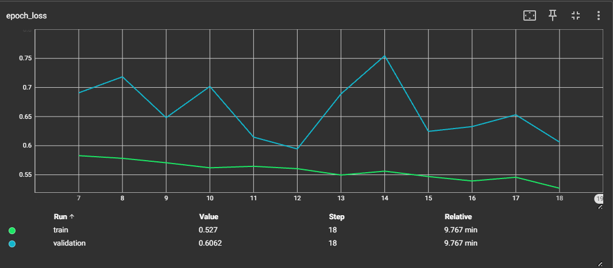

# Intel Image Classification — CNN from Scratch

   

## Overview

This project builds a **Convolutional Neural Network (CNN) from scratch** to classify natural scene images into 6 categories. The goal was to deliberately avoid Transfer Learning and test the capability of a custom-built CNN on a dataset whose classes do not exist in ImageNet — making it a genuine benchmark of scratch model performance.

A Transfer Learning approach using pretrained models is planned as the next phase of this project.

---

## Dataset

**Intel Image Classification** — [Kaggle Link](https://www.kaggle.com/datasets/puneet6060/intel-image-classification)

| Split | Images |
|-------|--------|
| Train | ~14,000 |
| Test  | ~3,000 |
| Prediction (unlabelled) | ~7,000 |

**Classes (6):** `buildings`, `forest`, `glacier`, `mountain`, `sea`, `street`

**Image size:** 150 × 150 × 3 (RGB)

### Why this dataset?
Most CNN tutorials rely on Transfer Learning with ImageNet pretrained weights. The 6 scene categories in this dataset — buildings, forest, glacier, mountain, sea, street — **are not standard ImageNet classes**, which means pretrained feature maps offer no direct advantage. This makes it an honest testbed for evaluating a scratch-built CNN's learning capability without any pretrained shortcut.

---

## Project Structure

```
Intel-Image-Classification/
├── 01_CNN_from_scratch.ipynb       # Main notebook
├── 02_Transfer_Learning.ipynb      # Coming soon
├── models/
│   └── BEST_MODEL.keras            # Saved best model weights
└── README.md
```

---

## Model Architecture

A custom Sequential CNN with the following design:

- **Data Augmentation** — RandomFlip, RandomRotation, RandomZoom, RandomTranslation (applied only during training)
- **Conv Block 1** — Conv2D(16) → Conv2D(64) → BatchNorm → ReLU → MaxPool → SpatialDropout(0.2)
- **Conv Block 2** — Conv2D(128) → BatchNorm → ReLU → MaxPool
- **Conv Block 3** — Conv2D(128) → BatchNorm → ReLU → MaxPool → SpatialDropout(0.2)
- **Head** — GlobalMaxPool → Dense(128, ReLU) → BatchNorm → Dense(64, ReLU) → BatchNorm → Dense(6, Softmax)

**Total Parameters:** ~265,878

---

## Training Strategy

- **Optimizer:** RMSprop (lr = 0.001)
- **Loss:** Sparse Categorical Crossentropy
- **Hyperparameter Tuning:** Keras Tuner with two tuning runs — filter sizes, kernel sizes, pooling sizes, dropout rates, and optimizers were tuned
- **Callbacks:** EarlyStopping, ReduceLROnPlateau, ModelCheckpoint, TensorBoard

---

## Results

| Model | Train Accuracy | Test Accuracy |
|-------|---------------|---------------|
| CNN from Scratch | 80.27% | **77.80%** |
| Transfer Learning | — | 🔄 Coming Soon |

The train-test gap of only **2.5%** indicates healthy generalization with minimal overfitting.

---

## Training Curves

> **Note:** Epochs start from 8 because the best hyperparameter configuration was identified after 7 epochs of tuning. Full training resumed from epoch 8 onwards using the best tuned weights.

| Accuracy | Loss |
|----------|------|
|  |  |

**Interpretation:**

**Accuracy (Epochs 8–18):**
- Train accuracy climbs steadily from ~78% → 80%, showing the model is consistently learning
- Validation accuracy fluctuates between 73–78%, with a best peak of **77.53%** at epoch 12
- The gap between train and val is small and consistent — indicates **healthy generalization with no severe overfitting**

**Loss (Epochs 8–18):**
- Train loss decreases smoothly from ~0.58 → 0.527, confirming stable learning
- Validation loss fluctuates heavily (spikes visible at epochs 8 and 14) — this instability is the primary **mild overfitting signal**
- The fact that val loss never diverges permanently confirms that SpatialDropout + Augmentation are containing overfitting, but the architecture has reached its representational ceiling at **77.8%**

---

## Key Observations

- Both hyperparameter tuning runs converged to the same **77.8% ceiling**, confirming the architecture itself is the bottleneck — not regularization or optimizer choice
- Heavy regularization (L2 + Dropout + Augmentation combined) caused mild underfitting — val accuracy marginally exceeded train accuracy in early epochs
- This ceiling justifies the move to Transfer Learning as the next phase

---

## Tech Stack

- Python 3.10
- TensorFlow / Keras
- Keras Tuner
- Matplotlib, Seaborn
- Google Colab (T4 GPU)

---

## How to Run

1. Clone the repository
2. Open `01_CNN_from_scratch.ipynb` in Google Colab
3. Upload your `kaggle.json` API key when prompted
4. Run all cells sequentially

---

## Next Steps

- [ ] Prediction visualization on unlabelled `seg_pred` data
- [ ] Confusion matrix and classification report
- [ ] Transfer Learning with MobileNetV2 / EfficientNetB0
- [ ] Streamlit deployment

---

*Part of an ongoing Deep Learning portfolio — M.Sc. Statistics, University of Delhi*
