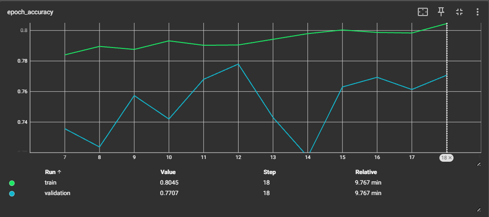
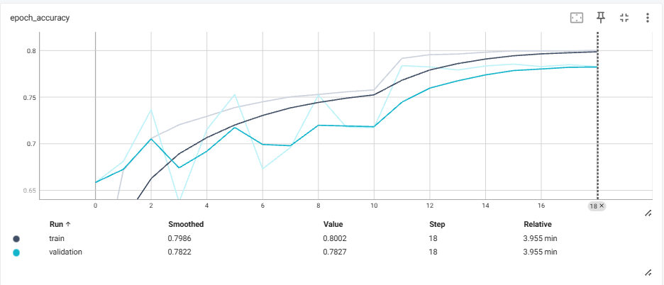
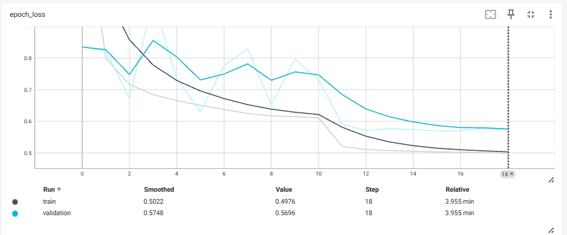

# Intel Image Classification — CNN from Scratch to Transfer Learning

   

## Overview

This project classifies natural scene images into 6 categories using a progressive deep learning approach — starting from a **CNN built from scratch**, then applying **Transfer Learning with MobileNetV2**, and finally **EfficientNetB3** for maximum accuracy. 

The dataset was deliberately chosen because its 6 scene categories are not standard ImageNet classes, making it an honest benchmark for evaluating both scratch and pretrained model performance.

---

## Dataset

**Intel Image Classification** — [Kaggle Link](https://www.kaggle.com/datasets/puneet6060/intel-image-classification)

| Split | Images |
|-------|--------|
| Train | ~14,000 |
| Test  | ~3,000 |
| Prediction (unlabelled) | ~7,000 |

**Classes (6):** `buildings`, `forest`, `glacier`, `mountain`, `sea`, `street`

**Image size:** 150 × 150 × 3 (RGB)

### Why this dataset?
Most CNN tutorials rely on Transfer Learning with ImageNet pretrained weights. The 6 scene categories in this dataset — buildings, forest, glacier, mountain, sea, street — **are not standard ImageNet classes**, which means pretrained feature maps offer no direct advantage. This makes it an honest testbed for evaluating a scratch-built CNN's learning capability without any pretrained shortcut.

---

## Project Structure

```
Intel-Image-Classification/
├── notebooks/
│   ├── 01_CNN_from_scratch.ipynb
│   ├── 02_Pretrained_MobileNetV2.ipynb
│   └── 03_EfficientNetB3.ipynb             # Coming soon
├── models/
│   ├── BEST_MODEL.keras                    # CNN from scratch
│   └── BEST_MODEL_MOBILENET.keras          # MobileNetV2 best
├── images/
│   ├── cnn_accuracy.png
│   ├── cnn_loss.png
│   ├── mobilenet_accuracy.png
│   └── mobilenet_loss.png
└── README.md
```

---

## Approach & Results

| Model | Train Accuracy | Test Accuracy | Generalization Gap |
|-------|---------------|---------------|--------------------|
| CNN from Scratch | 80.27% | **77.80%** | 2.5% |
| MobileNetV2 (Transfer Learning) | 85.20% | **83.40%** | 1.8% |
| EfficientNetB3 (Transfer Learning) | — | 🔄 Coming Soon | — |

**Key insight:** The generalization gap actually *improved* from scratch CNN (2.5%) to MobileNetV2 (1.8%), confirming that pretrained features not only boost accuracy but also improve generalization.

---

## Model 1 — CNN from Scratch

A custom Sequential CNN built without any pretrained weights.

**Architecture:**
- **Data Augmentation** — RandomFlip, RandomRotation, RandomZoom, RandomTranslation
- **Conv Block 1** — Conv2D(16) → Conv2D(64) → BatchNorm → ReLU → MaxPool → SpatialDropout(0.2)
- **Conv Block 2** — Conv2D(128) → BatchNorm → ReLU → MaxPool
- **Conv Block 3** — Conv2D(128) → BatchNorm → ReLU → MaxPool → SpatialDropout(0.2)
- **Head** — GlobalMaxPool → Dense(128, ReLU) → BatchNorm → Dense(64, ReLU) → BatchNorm → Dense(6, Softmax)

**Total Parameters:** ~265,878

**Training:**
- Optimizer: RMSprop (lr = 0.001)
- Hyperparameter Tuning: Keras Tuner (2 runs)
- Callbacks: EarlyStopping, ReduceLROnPlateau, ModelCheckpoint, TensorBoard

**Training Curves:**

> **Note:** Epochs start from 8 because the best hyperparameter configuration was identified after 7 epochs of tuning. Full training resumed from epoch 8 onwards.

| Accuracy | Loss |
|----------|------|
|  |  |

**Interpretation:**
- Train accuracy climbs steadily from ~78% → 80%; validation fluctuates between 73–78%
- Both HP tuning runs converged to the same **77.8% ceiling** — confirming the architecture is the bottleneck, not regularization or optimizer choice
- This ceiling justified the move to Transfer Learning

---

## Model 2 — MobileNetV2 (Transfer Learning)

Pretrained MobileNetV2 (ImageNet weights) with custom classification head. Base layers frozen initially, then fine-tuned progressively.

**Architecture:**
- **Data Augmentation** — RandomFlip, RandomRotation, RandomZoom, RandomTranslation
- MobileNetV2 base (last 20 layers unfrozen for fine-tuning, rest frozen)
- MaxPooling2D(3×3) → Flatten → Dense(128, ReLU) → Dense(64, ReLU) → Dense(6, Softmax)

**Total Parameters:** 2,430,598 — Trainable: 1,225,094 — Non-trainable: 1,205,504

**Training:**
- Optimizer: RMSprop (default)
- Loss: Sparse Categorical Crossentropy
- Regularization: Data Augmentation
- Callbacks: EarlyStopping (patience=6), ReduceLROnPlateau (patience=5), ModelCheckpoint, TensorBoard
- 3 progressive fine-tuning runs with increasing unfrozen layers — best result from Run 3

**Training Curves (Best Run):**

> **Note:** Model was trained for 36 epochs total across two runs (30 + 10 epochs with `initial_epoch`). TensorBoard logs captured only up to epoch 18 due to a session interruption in the second run — the graphs below reflect epochs 0–18. Final reported metrics are taken directly from training logs.

| Accuracy | Loss |
|----------|------|
|  |  |

**Interpretation:**

**Accuracy (Epochs 0–18, from TensorBoard):**
- Both train and validation accuracy show a consistent upward trend from ~65% → 80% and ~65% → 78% respectively
- Validation fluctuates in early epochs (1–7) — val loss was high (1.2–1.7) indicating the frozen pretrained weights were not yet adapted to the new classes
- After epoch 8 (val accuracy jumped to 81.77%) both curves stabilize and climb together
- ReduceLROnPlateau triggered at epoch 16 (lr: 0.001 → 0.0001) — caused a noticeable accuracy jump at epoch 17 (82.63%) and epoch 18 (82.93%)

**Loss (Epochs 0–18, from TensorBoard):**
- Train loss decreases steadily from ~0.93 → 0.44 — smooth and stable learning throughout
- Validation loss starts very high (~1.22) in early epochs due to pretrained weight mismatch, then converges significantly after epoch 8
- By epoch 18 val loss reached 0.54 — both curves trending downward with no divergence

**Full Training Summary (from logs, Epochs 1–30):**
- Best val accuracy of **83.4%** achieved at epoch 24 (train: 83.7%, val loss: 0.4839) — saved by ModelCheckpoint
- After epoch 24, val accuracy plateaued between 82–83.4% — model had reached its ceiling
- ReduceLROnPlateau triggered again at epoch 35 (lr: 1e-4 → 1e-5)
- EarlyStopping triggered at epoch 30 (first run) and epoch 36 (second run) — model fully converged
- **Final best: Train 83.7% — Val 83.4% — Gap: 0.3%** — near-perfect generalization

---

## Key Observations

- Both HP tuning runs on scratch CNN converged to 77.8% — architecture was the bottleneck
- MobileNetV2 with fine-tuning improved accuracy by **5.6%** and reduced generalization gap from 2.5% → 1.8%
- Progressive fine-tuning (unfreezing more layers across runs) was key — too frozen = underfitting, too unfrozen = overfitting
- EfficientNetB3 expected to push further to ~90%+ due to compound scaling and Squeeze & Excitation blocks

---

## Tech Stack

- Python 3.10
- TensorFlow / Keras
- Keras Tuner
- Matplotlib, Seaborn
- Google Colab (T4 GPU)

---

## How to Run

1. Clone the repository
2. Open any notebook in `notebooks/` folder in Google Colab
3. Upload your `kaggle.json` API key when prompted
4. Run all cells sequentially

---

## Next Steps

- [ ] EfficientNetB3 Transfer Learning
- [ ] Prediction visualization on unlabelled `seg_pred` data
- [ ] Confusion matrix and classification report on best model
- [ ] Streamlit deployment

---

*Part of an ongoing Deep Learning portfolio — M.Sc. Statistics, University of Delhi*
