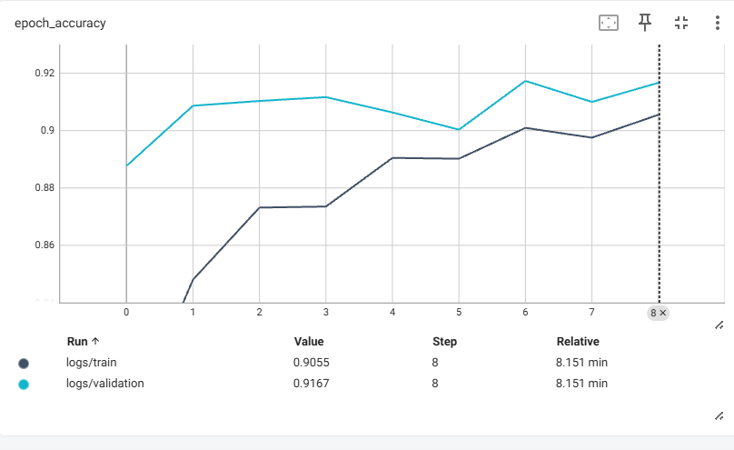
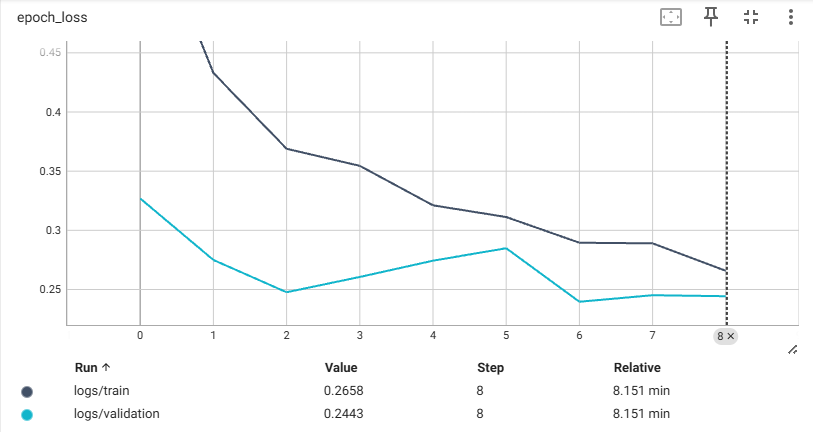
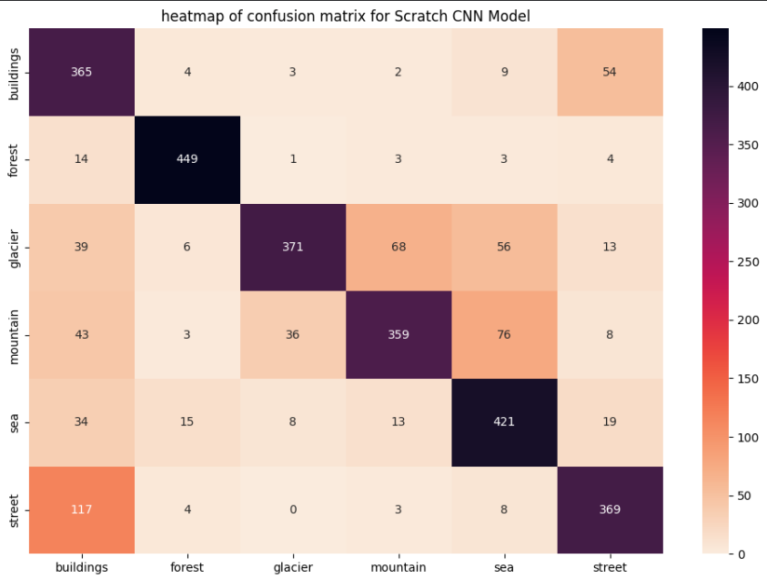
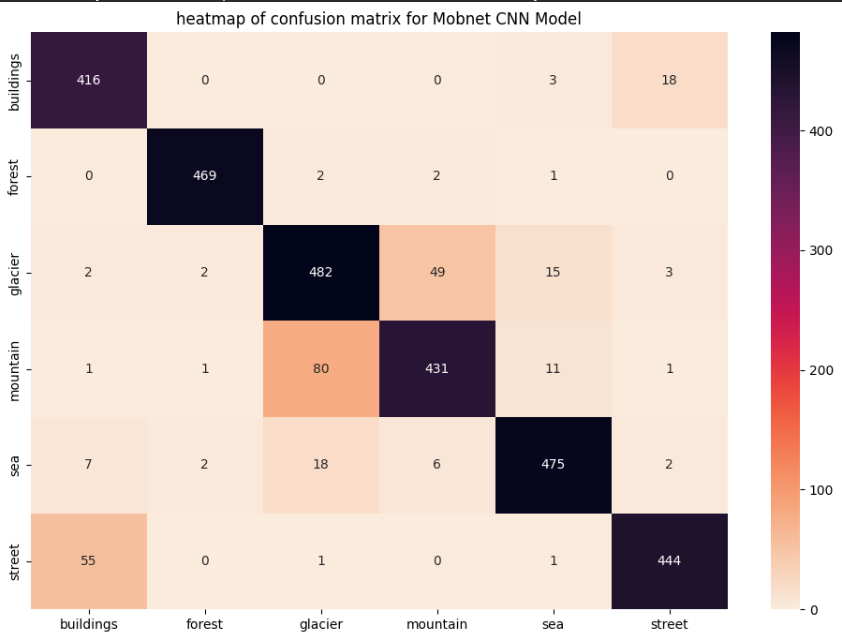
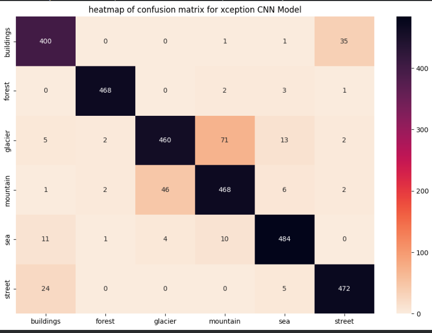
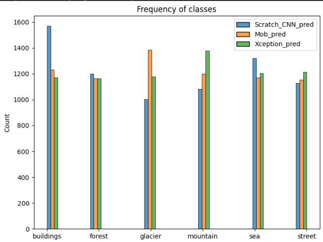
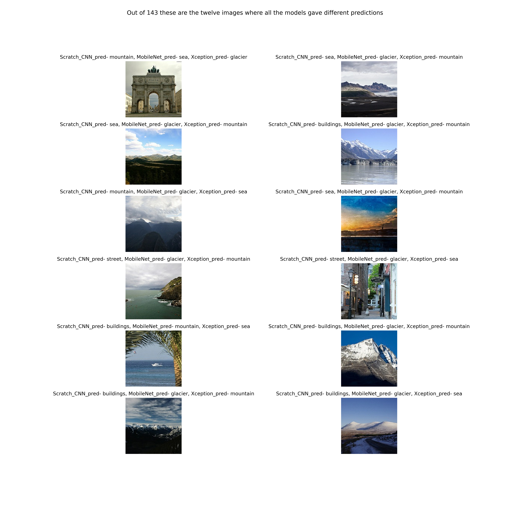

# Intel Image Classification — CNN from Scratch to Transfer Learning

   

## Overview

This project classifies natural scene images into 6 categories using a progressive deep learning approach — starting from a **CNN built from scratch**, then applying **Transfer Learning with MobileNetV2**, and finally **Xception** for maximum accuracy.

The dataset was deliberately chosen because its 6 scene categories are not standard ImageNet classes, making it an honest benchmark for evaluating both scratch and pretrained model performance.

---

## Dataset

**Intel Image Classification** — [Kaggle Link](https://www.kaggle.com/datasets/puneet6060/intel-image-classification)

| Split | Images |
|-------|--------|
| Train | ~14,000 |
| Test  | ~3,000 |
| Prediction (unlabelled) | ~7,000 |

**Classes (6):** `buildings`, `forest`, `glacier`, `mountain`, `sea`, `street`

**Image size:** 150 × 150 × 3 (RGB)

### Why this dataset?
Most CNN tutorials rely on Transfer Learning with ImageNet pretrained weights. The 6 scene categories in this dataset — buildings, forest, glacier, mountain, sea, street — **are not standard ImageNet classes**, which means pretrained feature maps offer no direct advantage. This makes it an honest testbed for evaluating a scratch-built CNN's learning capability without any pretrained shortcut.

---

## Project Structure

```Intel-Image-Classification/
│
├── notebooks/
│   ├── 01_CNN_from_scratch.ipynb
│   ├── 02_Pretrained_MobileNetV2.ipynb
│   ├── 03_Xception_Transfer_Learning.ipynb
│   └── 04_Model_Comparison.ipynb
│
├── models/
│   ├── BEST_MODEL.keras                    # CNN from scratch
│   ├── BEST_MODEL_MOBILENET.keras          # MobileNetV2 best
│   └── README.md                          # Xception too large (112MB) — Drive link inside
│
├── images/
│   ├── cnn_accuracy.png                   
│   ├── cnn_loss.png                       
│   ├── mobilenet_accuracy.png             
│   ├── mobilenet_loss.png                 
│   ├── xception_accuracy.png              
│   ├── xception_loss.png                  
│   ├── confusion_matrices/                
│   │   ├── cm_scratch_cnn.png
│   │   ├── cm_mobilenet.png
│   │   └── cm_xception.png
│   └── comparison/                        
│       ├── disagreement_images.png
│       └── prediction_frequency.png
│
└── README.md
```

---

## Approach & Results

| Model | Train Accuracy | Test Accuracy | Generalization Gap |
|-------|---------------|---------------|--------------------|
| CNN from Scratch | 80.27% | **77.80%** | 2.5% |
| MobileNetV2 (Transfer Learning) | 88.37% | **90.57%** | -2.2% (val > train) |
| Xception (Transfer Learning) | 93.55% | **91.73%** | 1.8% |

**Key insight:** Progressive improvement across all three architectures — **13.93% jump from scratch CNN to Xception** — with both Transfer Learning models showing val accuracy exceeding train accuracy, confirming strong generalization.

---

## Model 1 — CNN from Scratch

A custom Sequential CNN built without any pretrained weights.

**Architecture:**
- **Data Augmentation** — RandomFlip, RandomRotation, RandomZoom, RandomTranslation
- **Conv Block 1** — Conv2D(16) → Conv2D(64) → BatchNorm → ReLU → MaxPool → SpatialDropout(0.2)
- **Conv Block 2** — Conv2D(128) → BatchNorm → ReLU → MaxPool
- **Conv Block 3** — Conv2D(128) → BatchNorm → ReLU → MaxPool → SpatialDropout(0.2)
- **Head** — GlobalMaxPool → Dense(128, ReLU) → BatchNorm → Dense(64, ReLU) → BatchNorm → Dense(6, Softmax)

**Total Parameters:** ~265,878

**Training:**
- Optimizer: RMSprop (lr = 0.001)
- Loss: Sparse Categorical Crossentropy
- Hyperparameter Tuning: Keras Tuner (2 runs)
- Callbacks: EarlyStopping, ReduceLROnPlateau, ModelCheckpoint, TensorBoard

**Training Curves:**

> **Note:** Epochs start from 8 because the best hyperparameter configuration was identified after 7 epochs of tuning. Full training resumed from epoch 8 onwards.

| Accuracy | Loss |
|----------|------|
|  |  |

**Interpretation:**
- Train accuracy climbs steadily from ~78% → 80%; validation fluctuates between 73–78%
- Both HP tuning runs converged to the same **77.8% ceiling** — confirming the architecture is the bottleneck, not regularization or optimizer choice
- This ceiling justified the move to Transfer Learning

---
## Model 2 — MobileNetV2 (Transfer Learning)

Pretrained MobileNetV2 (ImageNet weights) with custom classification head. Base layers frozen initially, then fine-tuned progressively across 3 runs.

**Architecture:**
- **Data Augmentation** — RandomFlip, RandomRotation, RandomZoom, RandomTranslation
- MobileNetV2 base (last 20 layers unfrozen for fine-tuning, rest frozen)
- MaxPooling2D(3×3) → Flatten → Dense(128, ReLU) → Dense(64, ReLU) → Dense(6, Softmax)

**Total Parameters:** 2,430,598 — Trainable: 1,225,094 — Non-trainable: 1,205,504

**Training:**
- Optimizer: RMSprop (default)
- Loss: Sparse Categorical Crossentropy
- Regularization: Data Augmentation
- Callbacks: EarlyStopping (patience=6), ReduceLROnPlateau (patience=5), ModelCheckpoint, TensorBoard
- 3 progressive fine-tuning runs with increasing unfrozen layers — best result from Run 3 (30 epochs, EarlyStopping at epoch 17)

**Training Curves (Best Run):**

| Accuracy | Loss |
|----------|------|
|  |  |

**Interpretation:**

**Accuracy (Epochs 1–17, from TensorBoard):**
- Validation accuracy starts strong at **83.6% in epoch 1**, fluctuates in epochs 2-3 (76-77%) as the model adjusts to the new classes, then climbs steadily
- Train accuracy rises steadily from ~74% → 89% across the run
- ReduceLROnPlateau triggered at epoch 6 (lr: 0.001 → 0.0001) — causes a sharp jump in val accuracy from 86.6% (epoch 6) to 89.6% (epoch 7) to 90.4% (epoch 8)
- From epoch 8 onwards, val accuracy stabilizes in the 90-90.6% range while train accuracy continues rising toward 88-89% — val consistently above or near train

**Loss (Epochs 1–17, from TensorBoard):**
- Train loss decreases steadily from 0.72 → 0.30 — smooth and stable learning
- Validation loss is volatile in early epochs (spikes to 1.17-1.38 in epochs 2-3) due to the higher initial learning rate destabilizing pretrained weights
- After the lr drop at epoch 6, val loss drops sharply and stabilizes around 0.32-0.39 — closely tracking train loss with no divergence

**Full Training Summary (from logs, Epochs 1–17):**
- Best val accuracy of **90.57%** achieved at epoch 12 (train: 88.37%, val loss: 0.3211) — saved by ModelCheckpoint
- Val accuracy consistently exceeded train accuracy from epoch 7 onwards — excellent generalization with no overfitting
- ReduceLROnPlateau triggered at epoch 6 (lr: 0.001 → 0.0001) — caused a significant jump from 86.6% → 90%+
- EarlyStopping triggered at epoch 17 — model fully converged
- **Final best: Train 88.37% — Val 90.57% — val > train confirms strong generalization**

---

## Model 3 — Xception (Transfer Learning)

Pretrained Xception (ImageNet weights) with custom classification head. Last 20 layers unfrozen for fine-tuning.

**Architecture:**
- **Data Augmentation** — RandomFlip, RandomRotation, RandomZoom, RandomTranslation
- Xception base (last 20 layers unfrozen, rest frozen)
- GlobalMaxPooling2D → Dense(256, ReLU) → BatchNorm → Dense(128, ReLU) → BatchNorm → Dense(64, ReLU) → BatchNorm → Dense(6, Softmax)

**Training:**
- Optimizer: RMSprop (default)
- Loss: Sparse Categorical Crossentropy
- Regularization: Data Augmentation
- Callbacks: EarlyStopping (patience=6), ReduceLROnPlateau, ModelCheckpoint, TensorBoard
- Stopped at epoch 9 via EarlyStopping — model converged quickly

**Training Curves:**

| Accuracy | Loss |
|----------|------|
|  |  |

**Interpretation:**

**Accuracy (Epochs 0–8):**
- Validation accuracy starts at **88.8% from epoch 1** — pretrained Xception features are immediately powerful even for non-ImageNet classes
- Train accuracy climbs steadily from 79.4% → 90.6% while val stays consistently above train in early epochs (89–91%)
- Val accuracy peaks at **91.73% at epoch 7** — saved by ModelCheckpoint
- Both curves converge closely by epoch 8 confirming stable generalization

**Loss (Epochs 0–8):**
- Train loss drops sharply from 0.46 → 0.27 — fast and stable learning
- Val loss consistently lower than train loss throughout — **no overfitting signal at all**
- Both curves trend downward together, converging by epoch 8

**Full Training Summary (from logs):**
- Best val accuracy of **91.73%** achieved at epoch 7
- Train accuracy at best checkpoint: 90.1%, val loss: 0.2396
- model.evaluate() — Train: **93.55%**, Test: **91.73%** — Gap: **1.82%**
- EarlyStopping triggered at epoch 9 — model fully converged in just 9 epochs

---

## Model Comparison & Error Analysis

A dedicated comparison notebook (`04_Model_Comparison.ipynb`) loads all three trained models and evaluates them on the test set (3000 images) and the unlabelled prediction set (7301 images).

### Test Set Performance (3000 images)

| Model | Accuracy | Macro F1 |
|-------|----------|----------|
| CNN from Scratch | 78% | 0.78 |
| MobileNetV2 | 91% | 0.91 |
| Xception | 92% | 0.92 |

### Per-Class F1 Score Progression

| Class | Scratch | MobileNetV2 | Xception |
|-------|---------|-------------|----------|
| Buildings | 0.70 | 0.91 | 0.91 |
| Forest | 0.94 | 0.99 | 0.99 |
| Glacier | 0.76 | 0.85 | 0.87 |
| Mountain | 0.74 | 0.85 | 0.87 |
| Sea | 0.78 | 0.94 | 0.95 |
| Street | 0.76 | 0.92 | 0.93 |

### Confusion Matrices

| Scratch CNN | MobileNetV2 | Xception |
|-------------|-------------|----------|
|  |  |  |

**Key Pattern — Glacier-Mountain Confusion (consistent across ALL 3 models):**

| Model | Glacier→Mountain | Mountain→Glacier |
|-------|-------------------|-------------------|
| Scratch | 68 | 36 |
| MobileNetV2 | 49 | 80 |
| Xception | 71 | 46 |

This is the single most consistent error pattern across all architectures — these classes share similar rocky/icy textures and color palettes, even visually confusing for humans at a glance.

**Other notable patterns:**
- **Street → Buildings confusion** is significant in Scratch (117) and Xception (24), much lower in MobileNetV2 (55) — urban scenes naturally overlap
- **Forest** is near-perfect across all 3 models (94–99% F1) — the most visually distinct class in the dataset
- **Buildings** shows the biggest jump in performance: Scratch (70% F1) → MobileNetV2/Xception (91% F1) — pretrained ImageNet features transfer especially well for man-made structures

---

### Evaluation on Unlabelled Prediction Set (7,301 images)

Since `seg_pred` has no ground truth labels, model agreement was used as a proxy for prediction reliability — all three models (custom CNN, MobileNetV2, Xception) predicted on every image and predictions were compared.

| Agreement Level | Count | Percentage |
|------------------|-------|------------|
| All 3 models agree | 5,477 | 75.0% |
| 2 of 3 agree | 1,681 | 23.0% |
| All 3 disagree | 143 | 2.0% |

**75% unanimous agreement** across three architecturally distinct models (266K to 22M+ parameters) indicates the models are learning genuine, consistent visual patterns rather than memorizing noise. The **2% total disagreement** aligns with the genuinely ambiguous images discussed below.



---

### Disagreement Analysis — Where All Three Models Differ

Out of the 143 images where all three models gave different predictions, 12 were manually inspected and labelled by visual judgement, with each model's prediction and confidence score recorded.



| True Label (visual) | Scratch Pred | Scratch Conf | MobileNet Pred | MobileNet Conf | Xception Pred | Xception Conf |
|---|---|---|---|---|---|---|
| Building | mountain | 0.890 | sea | 1.000 | glacier | 0.999 |
| Glacier | sea | 0.657 | glacier | 0.971 | mountain | 0.504 |
| Mountain | sea | 0.429 | glacier | 0.999 | mountain | 0.972 |
| Glacier | buildings | 0.353 | glacier | 1.000 | mountain | 0.557 |
| Mountain | mountain | 0.980 | glacier | 0.996 | sea | 0.947 |
| Sea | sea | 0.927 | glacier | 0.841 | mountain | 0.949 |
| Sea | street | 0.964 | glacier | 1.000 | mountain | 0.997 |
| Street | street | 0.933 | glacier | 0.679 | sea | 0.971 |
| Sea | buildings | 0.749 | mountain | 0.961 | sea | 0.959 |
| Glacier | buildings | 0.733 | glacier | 0.661 | mountain | 0.978 |
| Glacier | buildings | 0.400 | glacier | 0.982 | mountain | 0.924 |
| Glacier | buildings | 0.611 | glacier | 0.953 | sea | 0.782 |

**Key findings:**

- **Overconfident wrong predictions:** Several models predict incorrectly with extremely high confidence (e.g., MobileNet predicts "sea" with 100% confidence on a true Building image; MobileNet predicts "glacier" with 99.99% confidence on a true Sea image). This shows even strong pretrained models can be **confidently wrong** on out-of-distribution-like images.
- **MobileNet shows the most overconfidence** on errors (frequently 95–100% confidence even when wrong), while **Xception's confidence on errors is comparatively more moderate** (50–98%) — making its mistakes more "calibrated."
- These 12 images themselves are genuinely ambiguous even to a human observer — several contain a mix of two or more scene elements (e.g., glacier + mountain + sea in the same frame, or sea + buildings + palm tree), explaining why no model converges on the same answer.
- This analysis demonstrates that remaining errors are largely driven by **inherent class overlap in the dataset** rather than model weakness — a meaningful distinction for understanding model limitations in production.

---

## Key Observations

- Scratch CNN converged to 77.8% ceiling across two independent HP tuning runs — architecture was the bottleneck
- MobileNetV2 improved accuracy by **12.77%** over scratch CNN with val accuracy exceeding train — strong generalization
- Xception achieved **91.73%** — a **13.93% improvement** over scratch CNN in just 9 epochs of training
- Xception's val accuracy exceeded train accuracy in early epochs — pretrained features generalize immediately
- Progressive fine-tuning (unfreezing last 20 layers) was key across both Transfer Learning models
- Glacier-Mountain confusion is the dominant, consistent error across all three architectures — driven by genuine visual similarity, not model deficiency
- On 7,301 unlabelled images, 75% unanimous agreement across all three models confirms consistent, generalizable feature learning
- Confidence-score analysis on disagreement cases reveals MobileNetV2 tends toward overconfident errors, while Xception's errors are better calibrated

---

## Tech Stack

- Python 3.10
- TensorFlow / Keras
- Keras Tuner
- Matplotlib, Seaborn
- Google Colab (T4 GPU)

---

## How to Run

1. Clone the repository
2. Open any notebook in `notebooks/` folder in Google Colab
3. Upload your `kaggle.json` API key when prompted
4. Run all cells sequentially

> 📦 **Xception Model:** Exceeds GitHub's 100MB limit. Download from [Google Drive](https://drive.google.com/file/d/1_sesT3Y5-_PJkrX_zcgpqCVhsg8N0xEL/view?usp=sharing)

---
